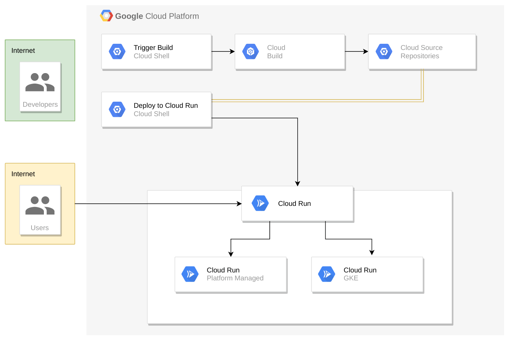
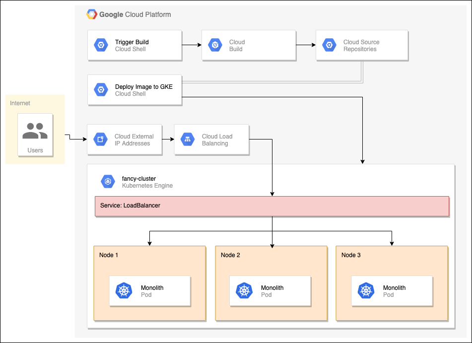

# LAB: Build a Website on Google Cloud

## 1. Deploy Your Website on Cloud Run

!!! abstract "Objectives"
    - How to build a Docker image using Cloud Build and upload it to Artifact Registry
    - How to deploy Docker images to Cloud Run
    - How to manage Cloud Run deployments
    - How to setup an endpoint for an application on Cloud Run

!!! note "Work flow"
    Local image -> Artifact Registry Repository -> Cloud Build -> Cloud Run

<div class="autocb" style="text-align:center;"></div>

### Clone the source repository

The website is a existed repository, first clone it and deploy it locally.

```sh
git clone https://github.com/googlecodelabs/monolith-to-microservices.git
cd ~/monolith-to-microservices
./setup.sh
cd ~/monolith-to-microservices/monolith
npm start
```

### Create a Docker container with Cloud Build

First create a repository in `Artifact Registry`.

Enable the API and submit the previous buil image to `Cloud Build`。

```sh
gcloud services enable artifactregistry.googleapis.com \
    cloudbuild.googleapis.com \
    run.googleapis.com
gcloud builds submit --tag Region-docker.pkg.dev/${GOOGLE_CLOUD_PROJECT}/monolith-demo/monolith:1.0.0
```

### Deploy the container to Cloud Run

The website has been containerized in `Cloud Build`, now use `Cloud Run` to run it.

```sh
gcloud run deploy monolith --image Region-docker.pkg.dev/${GOOGLE_CLOUD_PROJECT}/monolith-demo/monolith:1.0.0 --region Region
```

### Create new revision with lower concurrency

When deploy the containerized image to cloud run, `--concurrency` option can be specified the exact concurrency num.

```sh
gcloud run deploy monolith --image Region-docker.pkg.dev/${GOOGLE_CLOUD_PROJECT}/monolith-demo/monolith:1.0.0 --region Region --concurrency 1
```

### Make changes to the website

First make change locally 

```sh
cd ~/monolith-to-microservices/react-app/src/pages/Home
mv index.js.new index.js
cd ~/monolith-to-microservices/react-app
npm run build:monolith
```

Then submit it to `Cloud Build` with tag `2.0.0`.

```sh
cd ~/monolith-to-microservices/monolith
gcloud builds submit --tag Region-docker.pkg.dev/${GOOGLE_CLOUD_PROJECT}/monolith-demo/monolith:2.0.0
```

### Update website with zero downtime

To update the website **without interruption** to the users,  Cloud Run treats each deployment as a **new Revision** which will first be brought online, then have traffic **redirected** to it.

By default the latest revision will be assigned **100%** of the inbound traffic for a service. In command its just simple `run deploy` with second version.

```sh
gcloud run deploy monolith --image Region-docker.pkg.dev/${GOOGLE_CLOUD_PROJECT}/monolith-demo/monolith:2.0.0 --region Region
```

## 2. Hosting a Web App on Google Cloud Using Compute Engine

!!! abstract "Objectives"
    - Create Compute Engine instances
    - Create instance templates from source instances
    - Create managed instance groups
    - Create and test managed instance group health checks
    - Create HTTP(S) Load Balancers
    - Create load balancer health checks
    - Use a Content Delivery Network (CDN) for Caching

### Create Cloud Storage bucket

Use a Cloud Storage bucket to house **built code** as well as **startup scripts**.

```sh
gsutil mb gs://fancy-store-$DEVSHELL_PROJECT_ID
```

### Clone source repository

Similarly build the image locally.

```sh
git clone https://github.com/googlecodelabs/monolith-to-microservices.git
cd ~/monolith-to-microservices
./setup.sh
nvm install --lts
cd microservices
npm start
```

### Create Compute Engine instances

🔘 **Step 1. startup script to bucket**

A startup script will be used to instruct the instance what to do each time it is started.

```sh
#!/bin/bash

# Install logging monitor. The monitor will automatically pick up logs sent to
# syslog.
curl -s "https://storage.googleapis.com/signals-agents/logging/google-fluentd-install.sh" | bash
service google-fluentd restart &

# Install dependencies from apt
apt-get update
apt-get install -yq ca-certificates git build-essential supervisor psmisc

# Install nodejs
mkdir /opt/nodejs
curl https://nodejs.org/dist/v16.14.0/node-v16.14.0-linux-x64.tar.gz | tar xvzf - -C /opt/nodejs --strip-components=1
ln -s /opt/nodejs/bin/node /usr/bin/node
ln -s /opt/nodejs/bin/npm /usr/bin/npm

# Get the application source code from the Google Cloud Storage bucket.
mkdir /fancy-store
gsutil -m cp -r gs://fancy-store-[DEVSHELL_PROJECT_ID]/monolith-to-microservices/microservices/* /fancy-store/

# Install app dependencies.
cd /fancy-store/
npm install

# Create a nodeapp user. The application will run as this user.
useradd -m -d /home/nodeapp nodeapp
chown -R nodeapp:nodeapp /opt/app

# Configure supervisor to run the node app.
cat >/etc/supervisor/conf.d/node-app.conf << EOF
[program:nodeapp]
directory=/fancy-store
command=npm start
autostart=true
autorestart=true
user=nodeapp
environment=HOME="/home/nodeapp",USER="nodeapp",NODE_ENV="production"
stdout_logfile=syslog
stderr_logfile=syslog
EOF

supervisorctl reread
supervisorctl update
```

Copy the startup-script.sh file and source code into bucket.

```sh
gsutil cp ~/monolith-to-microservices/startup-script.sh gs://fancy-store-$DEVSHELL_PROJECT_ID
gsutil -m cp -r monolith-to-microservices gs://fancy-store-$DEVSHELL_PROJECT_ID/
```

🔘 **Step 2. Deploy backend**

The first instance to be deployed will be the backend instance which will house the **Orders and Products** microservices. Specified the startup script with `--metadata`.

```sh
gcloud compute instances create backend \
    --zone=$ZONE \
    --machine-type=e2-standard-2 \
    --tags=backend \
   --metadata=startup-script-url=https://storage.googleapis.com/fancy-store-$DEVSHELL_PROJECT_ID/startup-script.sh
```

🔘 **Step 3. Connect backent and frontend** 

To connect the frontend and backend, first edit `.env` file in frontend, point the url to `external_address` of backend instances.

```sh
REACT_APP_ORDERS_URL=http://[BACKEND_ADDRESS]:8081/api/orders
REACT_APP_PRODUCTS_URL=http://[BACKEND_ADDRESS]:8082/api/products
```

Then in similar step, copy frontend source code and deploy frontend instance.

```sh
gsutil -m cp -r monolith-to-microservices gs://fancy-store-$DEVSHELL_PROJECT_ID/
gcloud compute instances create frontend \
    --zone=$ZONE \
    --machine-type=e2-standard-2 \
    --tags=frontend \
    --metadata=startup-script-url=https://storage.googleapis.com/fancy-store-$DEVSHELL_PROJECT_ID/startup-script.sh
```

🔘 **Step 4. Configure network**

Create firewall rules to allow access to port 8080 for the frontend, and ports 8081-8082 for the backend.

```sh
gcloud compute firewall-rules create fw-fe \
    --allow tcp:8080 \
    --target-tags=frontend
gcloud compute firewall-rules create fw-be \
    --allow tcp:8081-8082 \
    --target-tags=backend
```

### Create managed instance groups

To allow the application to scale, managed instance groups will be created and will use the frontend and backend instances as **Instance Templates**.

A **managed instance group** (MIG) contains **identical** instances that you can manage as a **single entity** in a **single zone**.

🔘 **Step 1. Create instance template from source instance**

After stopping two instances, create the template like:

```sh
gcloud compute instance-templates create fancy-fe \
    --source-instance-zone=$ZONE \
    --source-instance=frontend
gcloud compute instance-templates create fancy-be \
    --source-instance-zone=$ZONE \
    --source-instance=backend
```

Now we can delete the `backend` vm to save resource space.

```sh
gcloud compute instances delete backend --zone=$ZONE
```

🔘 **Step 2. Create managed instance group**

Create managed instance from group.

```sh
gcloud compute instance-groups managed create fancy-fe-mig \
    --zone=$ZONE \
    --base-instance-name fancy-fe \
    --size 2 \
    --template fancy-fe
gcloud compute instance-groups managed create fancy-be-mig \
    --zone=$ZONE \
    --base-instance-name fancy-be \
    --size 2 \
    --template fancy-be
```

Set ports for the group

```sh
gcloud compute instance-groups set-named-ports fancy-fe-mig \
    --zone=$ZONE \
    --named-ports frontend:8080
gcloud compute instance-groups set-named-ports fancy-be-mig \
    --zone=$ZONE \
    --named-ports orders:8081,products:8082
```

🔘 **Step 3. Configure autohealing**

An autohealing policy relies on an **application-based health check** to verify that an app is responding as expected.

!!! note "Separated health checks for load balancing and for autohealing"
    Health checks for load balancing can and should be more aggressive because these health checks determine whether an instance receives user traffic. 

```sh
gcloud compute health-checks create http fancy-fe-hc \
    --port 8080 \
    --check-interval 30s \
    --healthy-threshold 1 \
    --timeout 10s \
    --unhealthy-threshold 3
gcloud compute health-checks create http fancy-be-hc \
    --port 8081 \
    --request-path=/api/orders \
    --check-interval 30s \
    --healthy-threshold 1 \
    --timeout 10s \
    --unhealthy-threshold 3
```
Create a firewall rule to allow the health check probes to connect to the microservices on ports 8080-8081.

```sh
gcloud compute firewall-rules create allow-health-check \
    --allow tcp:8080-8081 \
    --source-ranges 130.211.0.0/22,35.191.0.0/16 \
    --network default
```

Apply the health checks to their respective services.

```sh
gcloud compute instance-groups managed update fancy-fe-mig \
    --zone=$ZONE \
    --health-check fancy-fe-hc \
    --initial-delay 300
gcloud compute instance-groups managed update fancy-be-mig \
    --zone=$ZONE \
    --health-check fancy-be-hc \
    --initial-delay 300
```

### Create load balancers

Load balancer use mappings to send traffic to the proper backend services based on pathing rules. This exposes a single load balanced IP for all services.

🔘 **Step 1. create health check for load balancer**:  this will be used to determine which instances are capable of serving traffic for each service.

```sh
gcloud compute http-health-checks create fancy-fe-frontend-hc \
  --request-path / \
  --port 8080 
gcloud compute http-health-checks create fancy-be-orders-hc \
  --request-path /api/orders \
  --port 8081
gcloud compute http-health-checks create fancy-be-products-hc \
  --request-path /api/products \
  --port 8082
```

🔘 **Create backend services**: . The backend services will use the health checks and named ports

```sh
gcloud compute backend-services create fancy-fe-frontend \
  --http-health-checks fancy-fe-frontend-hc \
  --port-name frontend \
  --global
gcloud compute backend-services create fancy-be-orders \
  --http-health-checks fancy-be-orders-hc \
  --port-name orders \
  --global
gcloud compute backend-services create fancy-be-products \
  --http-health-checks fancy-be-products-hc \
  --port-name products \
  --global
```

🔘 **Step 3: add load balancer to backend service**

```sh
gcloud compute backend-services add-backend fancy-fe-frontend \
  --instance-group-zone=$ZONE \
  --instance-group fancy-fe-mig \
  --global
gcloud compute backend-services add-backend fancy-be-orders \
  --instance-group-zone=$ZONE \
  --instance-group fancy-be-mig \
  --global
gcloud compute backend-services add-backend fancy-be-products \
  --instance-group-zone=$ZONE \
  --instance-group fancy-be-mig \
  --global
```

🔘 **Step 4. Create a URL map**:  The URL map defines which URLs are directed to which backend services. create a proxy which ties to this URL map.

```sh
gcloud compute url-maps create fancy-map \
  --default-service fancy-fe-frontend
gcloud compute url-maps add-path-matcher fancy-map \
   --default-service fancy-fe-frontend \
   --path-matcher-name orders \
   --path-rules "/api/orders=fancy-be-orders,/api/products=fancy-be-products"
gcloud compute target-http-proxies create fancy-proxy \
  --url-map fancy-map
```

🔘 **Step 4: create a global forwarding rule**: public IP address which be forwarding to the proxy.

```sh
gcloud compute forwarding-rules create fancy-http-rule \
  --global \
  --target-http-proxy fancy-proxy \
  --ports 80
```

🔘 **Step 5: update frontend connection**: the code on the frontend to point to this new address instead of the ephemeral address used earlier that pointed to the backend instance.

```sh
REACT_APP_ORDERS_URL=http://[LB_IP]/api/orders
REACT_APP_PRODUCTS_URL=http://[LB_IP]/api/products
```

After upload the configuration to bucket, issue a rolling restart command. 

```sh
gcloud compute instance-groups managed rolling-action replace fancy-fe-mig \
    --zone=$ZONE \
    --max-unavailable 100%
```

### Scaling Compute Engine

Create an autoscaler on the managed instance groups that automatically adds instances when utilization is above 60% utilization, and removes instances when the load balancer is below 60% utilization.

```sh
gcloud compute instance-groups managed set-autoscaling \
  fancy-fe-mig \
  --zone=$ZONE \
  --max-num-replicas 2 \
  --target-load-balancing-utilization 0.60
gcloud compute instance-groups managed set-autoscaling \
  fancy-be-mig \
  --zone=$ZONE \
  --max-num-replicas 2 \
  --target-load-balancing-utilization 0.60
```

🔘 **Step 2. Enable content delivery network**: it can provide caching for the frontend.

When a user requests content from the HTTP(S) load balancer, the request arrives at a Google Front End (GFE) which first looks in the **Cloud CDN cache** for a response to the user's request. If the GFE finds a cached response, the GFE sends the cached response to the user. This is called a cache hit.

```sh
gcloud compute backend-services update fancy-fe-frontend \
    --enable-cdn --global
```

### Update the website

Existing instance templates are **not editable**. Normally for stateless machine, we only need to edit template, create new instance than redirect.

```sh
gcloud compute instance-groups managed rolling-action replace fancy-fe-mig \
  --zone=$ZONE \
  --max-unavailable=100%
```

## 3. Deploy, Scale, and Update Your Website on Google Kubernetes Engine

!!! abstract "Objectives"
    - Create a GKE cluster
    - Create a Docker container
    - Deploy the container to GKE
    - Expose the container via a service
    - Scale the container to multiple replicas
    - Modify the website
    - Rollout a new version with zero downtime
  
<div class="autocb" style="text-align:center;"></div>

### Create a GKE cluster

```sh
gcloud services enable container.googleapis.com
gcloud container clusters create fancy-cluster --num-nodes 3
```

### Clone source repository and run

Trivial step, clone source code and run locally.

```sh
git clone https://github.com/googlecodelabs/monolith-to-microservices.git
cd ~/monolith-to-microservices
./setup.sh
nvm install --lts
cd ~/monolith-to-microservices/monolith
npm start
```

### Create Docker container with Cloud Build

Basically this is same step as [Section2](./lab4.build_a_website.md#create-a-docker-container-with-cloud-build)

```sh
gcloud services enable cloudbuild.googleapis.com
cd ~/monolith-to-microservices/monolith
gcloud builds submit --tag gcr.io/${GOOGLE_CLOUD_PROJECT}/monolith:1.0.0
```

### Deploy container to GKE

Create a Deployment named monolith on your cluster with 1 replica.

```sh
kubectl create deployment monolith --image=gcr.io/${GOOGLE_CLOUD_PROJECT}/monolith:1.0.0
```

### Expose GKE deployment

The application must explicitly expose to traffic from the Internet via a **Service** resource.

```sh
kubectl expose deployment monolith --type=LoadBalancer --port 80 --target-port 8080
```

### Scale GKE deployment

Scale deployment up to 3 replicas

```sh
kubectl scale deployment monolith --replicas=3
```

### Make changes to the website and push

Similarly to previous lab, built locally first.

```sh
cd ~/monolith-to-microservices/react-app/src/pages/Home
mv index.js.new index.js
cd ~/monolith-to-microservices/react-app
npm run build:monolith
```

Submit new built with tag `2.0.0`

```sh
cd ~/monolith-to-microservices/monolith
gcloud builds submit --tag gcr.io/${GOOGLE_CLOUD_PROJECT}/monolith:2.0.0 .
```

### Update website with zero downtime with ks8

```sh
kubectl set image deployment/monolith monolith=gcr.io/${GOOGLE_CLOUD_PROJECT}/monolith:2.0.0
```

!!! note "Thinking"
    Using k8s is so convenience compare to lab 2...

## 4. Migrating a Monolithic Website to Microservices on Google Kubernetes Engine

### Build locally and create GKE cluster

Similar to previous steps.

```sh
cd ~
git clone https://github.com/googlecodelabs/monolith-to-microservices.git
cd ~/monolith-to-microservices
./setup.sh
gcloud services enable container.googleapis.com
gcloud container clusters create fancy-cluster --num-nodes 3 --machine-type=e2-standard-4
cd ~/monolith-to-microservices
./deploy-monolith.sh
kubectl get service monolith
```

### Migrate orders to a microservice

Now that the monolith website is running on GKE, start breaking each service into a **microservice**.

🔘 **Step 1. Create new orders microservice**

```sh
cd ~/monolith-to-microservices/microservices/src/orders
gcloud builds submit --tag gcr.io/${GOOGLE_CLOUD_PROJECT}/orders:1.0.0
kubectl create deployment orders --image=gcr.io/${GOOGLE_CLOUD_PROJECT}/orders:1.0.0
kubectl expose deployment orders --type=LoadBalancer --port 80 --target-port 8081
```

🔘 **Step 2. Reconfigure the monolith**

Modify the monolith to point to the new external Orders microservice.

When breaking down a monolith,  pieces of code are removed from a single codebase to **multiple microservices** and deploying them separately. 

```sh
cd ~/monolith-to-microservices/react-app
nano .env.monolith

# Edit content
REACT_APP_ORDERS_URL=http://<ORDERS_IP_ADDRESS>/api/orders
REACT_APP_PRODUCTS_URL=/service/products

npm run build:monolith
```

Then create a docker container and deploy it to GKE.

```sh
cd ~/monolith-to-microservices/monolith
gcloud builds submit --tag gcr.io/${GOOGLE_CLOUD_PROJECT}/monolith:2.0.0
kubectl set image deployment/monolith monolith=gcr.io/${GOOGLE_CLOUD_PROJECT}/monolith:2.0.0
```

### Migrate Products to microservice

The step is similar to migrate `order`

```sh
cd ~/monolith-to-microservices/microservices/src/products
gcloud builds submit --tag gcr.io/${GOOGLE_CLOUD_PROJECT}/products:1.0.0 .
kubectl create deployment products --image=gcr.io/${GOOGLE_CLOUD_PROJECT}/products:1.0.0
kubectl expose deployment products --type=LoadBalancer --port 80 --target-port 8082
cd ~/monolith-to-microservices/react-app
nano .env.monolith

## edit content
REACT_APP_ORDERS_URL=http://<ORDERS_IP_ADDRESS>/api/orders
REACT_APP_PRODUCTS_URL=/service/products

npm run build:monolith

# Create Docker Container with Cloud Build
cd ~/monolith-to-microservices/monolith
gcloud builds submit --tag gcr.io/${GOOGLE_CLOUD_PROJECT}/monolith:3.0.0

# Deploy on GKE
kubectl set image deployment/monolith monolith=gcr.io/${GOOGLE_CLOUD_PROJECT}/monolith:3.0.0
```

### Migrate frontend to microservice

Follow the same procedure as the last two steps to create a new frontend microservice.

```sh
cd ~/monolith-to-microservices/react-app
cp .env.monolith .env
npm run build

cd ~/monolith-to-microservices/microservices/src/frontend
gcloud builds submit --tag gcr.io/${GOOGLE_CLOUD_PROJECT}/frontend:1.0.0 .
kubectl create deployment frontend --image=gcr.io/${GOOGLE_CLOUD_PROJECT}/frontend:1.0.0
kubectl expose deployment frontend --type=LoadBalancer --port 80 --target-port 8080
```

## 5. Build a Website on Google Cloud: Challenge Lab

### Download the monolith code and build your container

```sh
git clone https://github.com/googlecodelabs/monolith-to-microservices
./setup.sh
nvm install --lts

cd ~/monolith-to-microservices/monolith
gcloud services enable cloudbuild.googleapis.com
gcloud builds submit --tag gcr.io/${GOOGLE_CLOUD_PROJECT}/fancy-monolith-164:1.0.0
```

### Create a kubernetes cluster and deploy the application

```sh
gcloud services enable container.googleapis.com
gcloud container clusters create fancy-production-342 --num-nodes 3 --region=us-west1

kubectl create deployment fancy-monolith-164 --image=gcr.io/${GOOGLE_CLOUD_PROJECT}/fancy-monolith-164:1.0.0
kubectl expose deployment fancy-monolith-164 --type=LoadBalancer --port 80 --target-port 8080
```

### Create new microservices

```sh
gcloud builds submit --tag gcr.io/${GOOGLE_CLOUD_PROJECT}/fancy-products-845:1.0.0
gcloud builds submit --tag gcr.io/${GOOGLE_CLOUD_PROJECT}/fancy-orders-794:1.0.0
```

### Deploy the new microservices

Orders Microservice

```sh
kubectl create deployment fancy-orders-794 --image=gcr.io/${GOOGLE_CLOUD_PROJECT}/fancy-orders-794:1.0.0
kubectl expose deployment fancy-orders-794 --type=LoadBalancer --port 80 --target-port 8081
```

Products Microservice

```sh
kubectl create deployment fancy-products-845 --image=gcr.io/${GOOGLE_CLOUD_PROJECT}/fancy-products-845:1.0.0
kubectl expose deployment fancy-products-845 --type=LoadBalancer --port 80 --target-port 8082
```

### Configure and deploy the Frontend microservice

```sh
cd ~/monolith-to-microservices/react-app
nano .env

REACT_APP_ORDERS_URL=http://34.83.70.232/api/orders
REACT_APP_PRODUCTS_URL=http://34.168.63.116/api/products

npm run build
```

### Create a containerized version of the Frontend microservice

```sh
gcloud builds submit --tag gcr.io/${GOOGLE_CLOUD_PROJECT}/fancy-frontend-161:1.0.0
```

### Deploy the Frontend microservice

```sh
kubectl create deployment fancy-frontend-161 --image=gcr.io/${GOOGLE_CLOUD_PROJECT}/fancy-frontend-161:1.0.0
kubectl expose deployment fancy-frontend-161 --type=LoadBalancer --port 80 --target-port 8080
```
