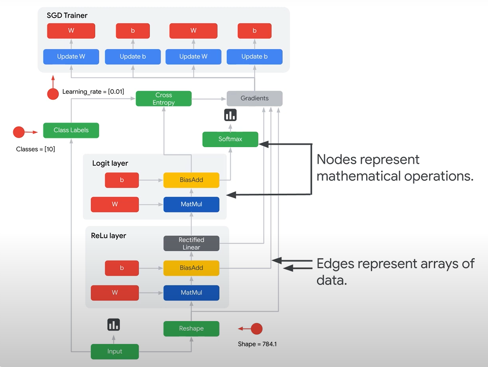
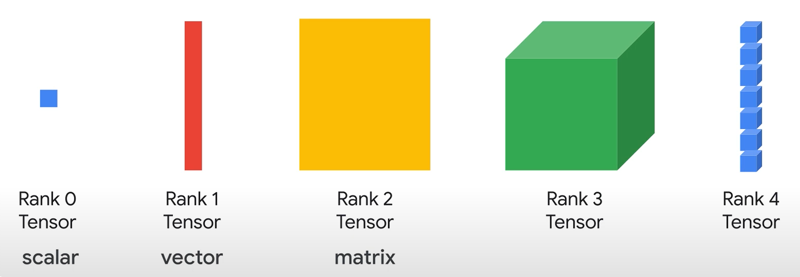
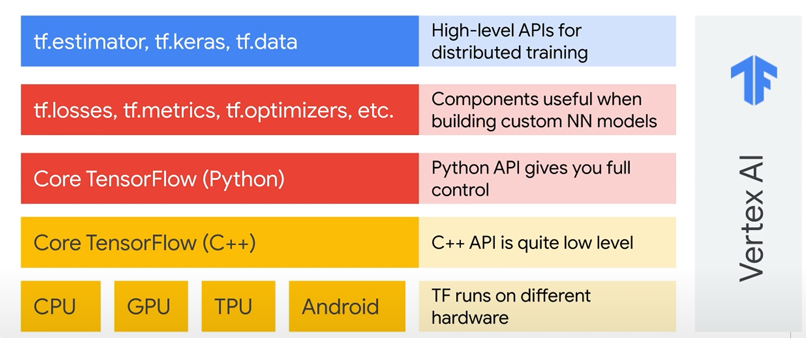
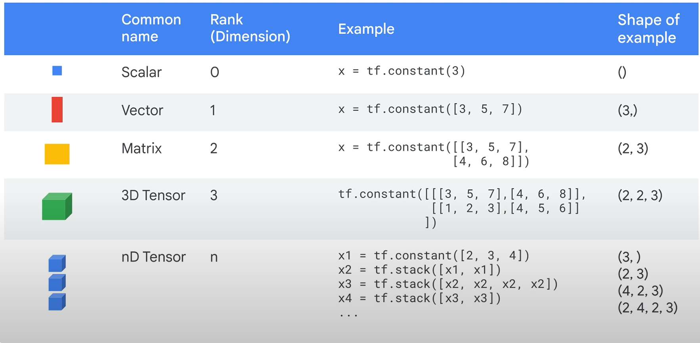
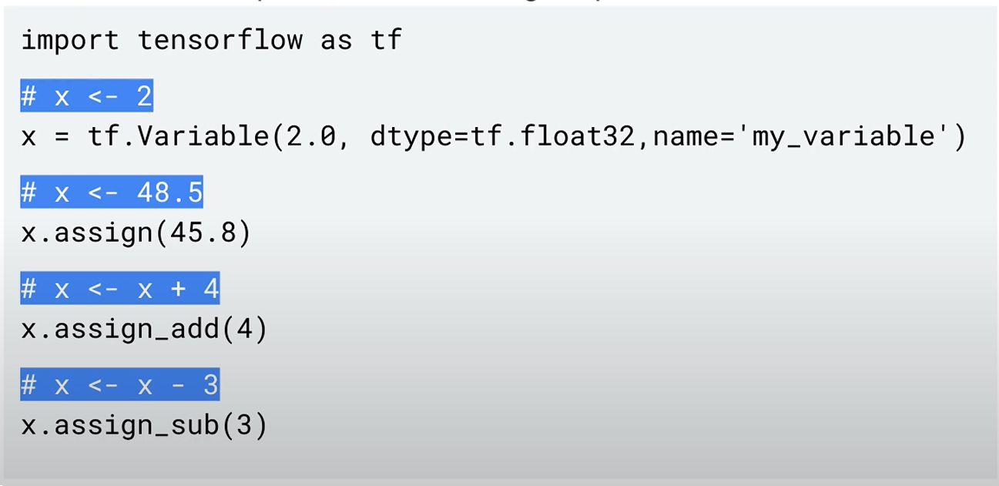

# 1. Introduction to the TensorFlow Ecosystem

!!! abstract "Take Away"
    - TensorFlow API hierarchy
    - the building blocks of tensors and operations
    - write low-level TensorFlow programs

## 1.1 Introduction to the TensorFlow

TensorFlow is an open-source, high-performance library for **numerical computation**, any numerical computation, not just for machine learning.

🔘 **TensorFlow workflow**

- The way tensorflow works: create a **directed graph**, or a **DAG**, to represent the computation.
- Nodes: represent mathematical operations.
- Edges: input and the output of those mathematical operations.
- ReLU layer: reshape data, the weight is then multiplied across that array of data in a matmul, or matrix multiplication operation.

🔘 **What is a tensor?**

A tensor is a N-dim array of data.

Tensors flow through the graph, hence the name TensorFlow. Use directed graph brings **portability**(python -> different platforms).

🔘 **Common development pattern**

- Train a TensorFlow model on the **cloud**.
- Take the train model and put it on a device out on the **edge**.
- Do predictions with the model right on the device itself **offline**.(smaller model, but faster response during predictions).

## 1.2 TensorFlow API hierarchy

🔘 **From bottom to top explain**

- 1st: target the different **hardware** platforms(transparent if you are not dealing with hardware)
- 2nd: TensorFlow **C++** API, write a custom TensorFlow operation(operator? mainly for ML researcher)
- 3rd: **Python API** contains much of the numeric processing code, `add`, `sub`, `div`, `mul`.
- 4th: **Python modules** that have high-level representation of useful neural network components.(often don't need a custom neural network model, standard is enough and even best).
- 5th: **high-level APIs** to do distributed training, data preprocessing, the model definition, compilation and overall training.

## 1.3 Components of Tensorflow: Tensors and variables

!!! abstract "Take Away" 
    - `tf.constant()` create constant tensor
    - `tf.Variable()` create variable tensor
    - `tf.stack()` stack to create higher dimension tensor
    - `tf.reshape(x,[row,col])` reshape a tensor with `row * col` element to new shape.
    - `y = x[:,1]`slice: same to numpy array, slicing n-1 dim tensor.

- Use `tf.constant()` to create a constant tensor with scalar/n-dim vector.
- Another way is to create 1-dim `constant`, then level up by `stack`.
- The core is **"shape of data"**.

- Use `tf.Variable(i, dtype=[], name=[])` to create variables. variable constructor requires an initial value `i` for the variable which can be a tensor of **any shape** and type.
- After construction, the type and shape of the variable are **fixed**.
- change value by `assign_op`, because tensorflow needs to remember all the operation in order to do the **reverse op** in backward pass.
