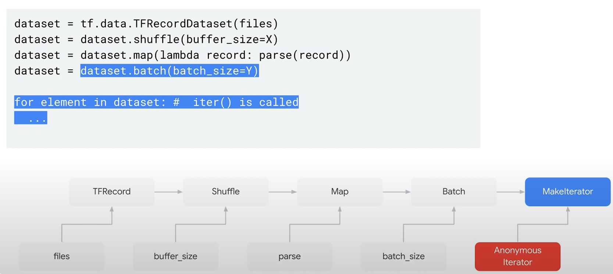

# 2. Design and Build an Input Data Pipeline

!!! abstract "Take Away"
    - train on Large Datasets with tf.data
    - work with in-memory files
    - get the data ready for training
    - describe embeddings
    - and understand scaling data with tf

🔘 **ML recap**
<div class="autocb" style="text-align:center;"></div>

## 2.1 Training on large datasets with tf.data API

`tf.data` API to build complex input pipelines from simple reusable pieces.

🔘 **Two distinct ways to create a dataset**

- Data source: constructs a dataset from data **stored in memory** or in one or more files.
- Data transformation: constructs a dataset from one or more **tf.dataset** objects.

🔘 **Dataset**

`tf.data.Dataset`: create input functions for your model that load data in progressively, throttling it.

<div class="autocb" style="text-align:center;"></div>

Example:

<div class="autocb" style="text-align:center;"></div>

- `TFRecord`: produces a variant Tensor, representing a dataset which is stored in the corresponding Python object.
- `shuffle`: maintains a fixed-size buffer and uniformly randomly selects the next element from the buffer

    ```py
    dataset = tf.data.Dataset.range(3)
    dataset = dataset.shuffle(3, reshuffle_each_iteration=True)
    dataset = dataset.repeat(2)
    # [1, 0, 2, 1, 2, 0]
    ```

- `map`: user-defined function to transform dataset.

    ```py
    dataset = Dataset.range(1, 6)  # ==> [ 1, 2, 3, 4, 5 ]
    dataset = dataset.map(lambda x: x + 1)
    list(dataset.as_numpy_iterator())
    [2,3,4,5,6]
    ```

- `batch`: Combines consecutive elements of this dataset into batches.

    ```py
    dataset = tf.data.Dataset.range(8)
    dataset = dataset.batch(3)
    list(dataset.as_numpy_iterator())
    [array([0,1,2]),array([3,4,5]),array([6,7])]
    ```

## 2.2 Working in-memory and with files

When data used to train a model sits in-memory, we can create an input pipeline by constructing a dataset using `tf.data.from_tensor_slices((X,Y))`

```py
# Slicing a tuple of 1D tensors produces tuple elements containing
# scalar tensors.
dataset = tf.data.Dataset.from_tensor_slices(([1, 2], [3, 4], [5, 6]))
list(dataset.as_numpy_iterator())
[(1,3,5),(2,4,6)]
```

## 2.3 Getting the data ready for model training

## 2.4 Embeddings
