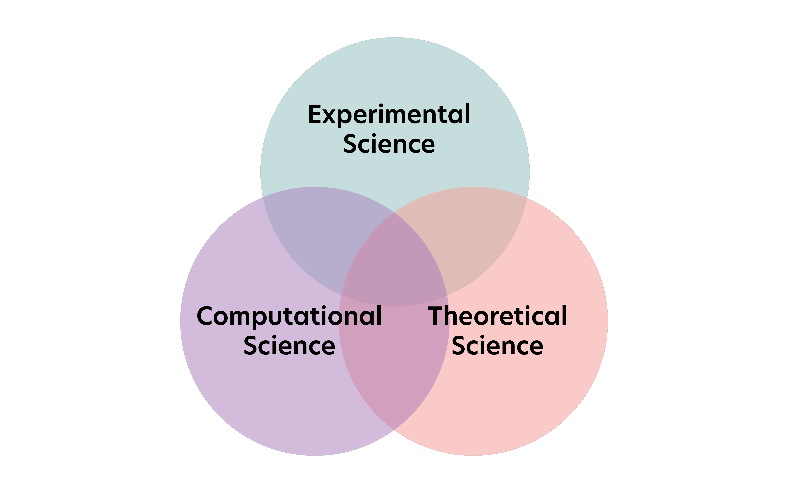
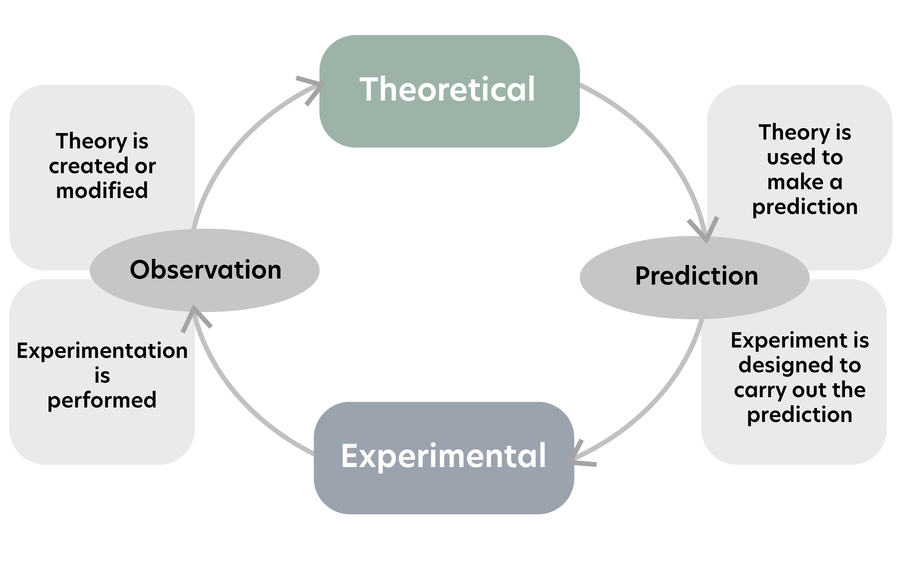

# 1. Introduction to HPC

<!-- 40 mins to complete -->
## 1.1 What is high-performance computing?

Supercomputer is defined as using **computing power** that is **vastly larger** than available in a typical desktop computer.

### Paradigms of science

🔘 **The three paradigms of science**

- **Experimental science**: observations and measurements
- **Theoretical science**: develops models which fit or “explain” measurements
- **Computational science**: design, implementation, and use of mathematical models to analyse and solve scientific problems via computer simulations and numerical analysis

🔘 **Data science: new paradigm**

Data science can be defined as a field that uses various mathematical methods and algorithms to extract knowledge and insight from data.

Related to machine learning(probabilistic models) and artificial intelligence(as a system, it learns from itself).

### HPC

!!! error "Problem with traditional desktop computer"
     Solving the problem which contains enormous computing work with standard computers might take years or be impossible as the problem cannot fit into memory.

Compared to single-used measure machines(particle accelerator, radiotelescope...) in different field, supercomputers can be used in **multitude of application areas**.

- Fundamental sciences such as particle physics and cosmology
- Climate, weather and earth sciences
- Life sciences and medicine
- Chemistry and material science
- Energy, e.g oil and gas exploration and fusion research
- Engineering, e.g. infrastructure and manufacturing
- Data analysis
- Artificial intelligence and machine learning

## 1.2  Key terms

🔘 **CPU**

- central processing unit which performs logical, arithmetic, controlling and input/output operations.
- Household computers usually have 4-8 cores(processing units), while server processors may have 64 cores.

🔘 **GPU**

- graphics processing unit which specialized in very simple but fast arithmetic.
- called **"accelerators"** because it accelerates the massive amount of calculations done in HPC.

🔘 **Disk :** long term storage used by a computer. Slow read and write.

🔘 **Memory :** random access memory (RAM), temporary storage from runtime program data. Fast R/W but wiped after shutting off computer. 

🔘 **Cache :** special memory, extremely small and fast.

🔘 **Node :**

- Basic block of supercomputer, contains CPUs and memory.
- equivalent to a desktop computer. In reverse, laptops/desktop can be a node in supercomputer.

🔘 **Cluster/Supercomputer :** formed by connecting a set of nodes together via a fast network.

🔘 **Interconnect :** high-speed network connecting hundreds or thousands of nodes

🔘 **Virtualization :** simulating the necessary hardware for a guest operating system. Virtualization makes $x$ nodes to be treated as a whole vm.

🔘 **Virtual Machine :** independent computer that is simulated using virtualization technology.

🔘 **MPI**

- message passing interface, allowing multiple nodes or cores to communicate with each other, and execute computation in parallel.
- MPI allocates **isolated memory** for each task.
- different levels of abstraction: CPU, nodes...

🔘 **OpenMP :**

- a parallel programming approach that is based on a **shared memory** model
- Program is split into multiple tasks which can exchange information by directly R/W to the common shared memory.
- levels of abstraction: **only** within a single node

## 3. Examples of HPC applications

- Collisions of nanoparticles
- Spreading of aerosols in the air
- Climate change
- Natural language processing
- Cancer diagnosis