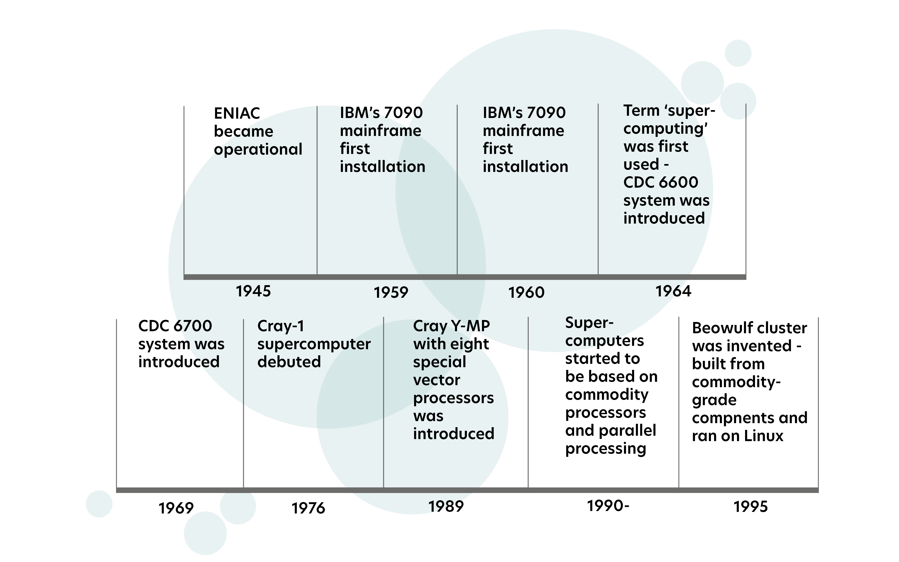
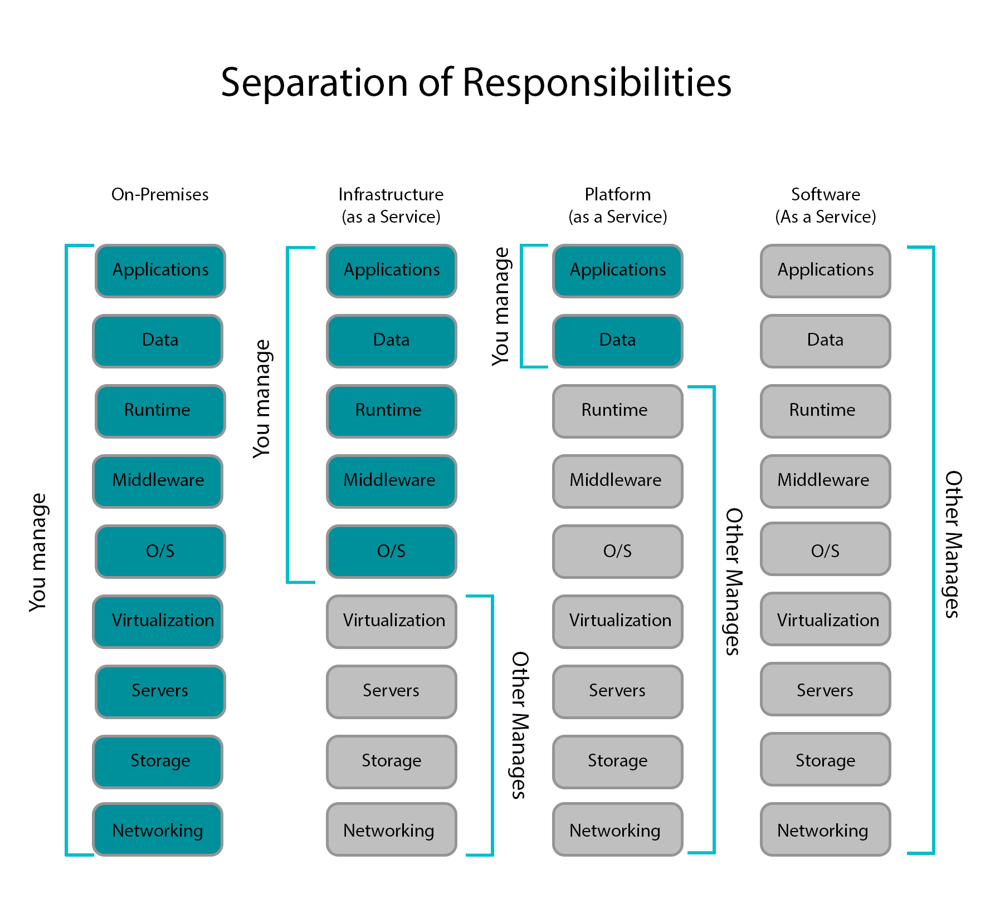

# 2. What is a supercomputer?

<!-- 1h 20min -->
## 2.1 History of supercomputing

- gears, levers, curved plates computer, not for programming
- 1945 ENIAC, electronic programmable general-purpose computer
- 1964 CDC 6600, term of supercomputer created
- 1990s, supercomputer based more on commodity processors.
- 2005, no longer follows Moore's law. Instead performance has been increased by adding multiple cores to a single CPU.

## 2.2 Supercomputing in Finland and at CSC

## 2.3 Modern supercomputer

### Components of High Performance Computing

Modern supercomputers are built using the same basic elements, such as CPUs(processors), GPU, memory, and disk, found in desktop computers. It also utilizes interconnect.

A supercomputer gets its power from all these CPU cores and GPUs working together **simultaneously** – working in parallel.

## 2.4 Supercomputer performance

🔘 **Measurement Standard:**  floating-point operations per second (FLOP/s)

🔘 **Theoretical Computing Power of a CPU core**: $\text{clock speed} * \text{FLOP/s}$.

🔘 Real performance is **less than** theoretical capability. (bounded by speed of CPU access to the memory; intercommunicate with other nodes)

🔘 Mahti has a theoretical peak performance of **7.5 PFLOP/s**. LUMI has **428.70 PFLOP/s**.

## 2.5 Data storage

Storage is an important factor of supercomputer performance.

🔘 **Two common types of disk drives**

- Hard disk drives (HDD) that use one or more rotating discs and rely on **magnetic** storage. [Cheap, slow, used for main storage]
- Solid-state drives (SSD) that have no moving mechanical parts but use **flash memory** like the one in a USB flash drive. [Expensive, fast, used for high-speed storage]

🔘 **Parallel file system**: applications R/W multiple disks simultaneously; multiple users to utilize the same storage simultaneously. Lustre, GPFS, BeeGFS, and Ceph... 

🔘 Mahti has a storage of 8.7 petabytes (PB) or 8,700 terabytes (TB), equivalent to over 170,000 Blu-rays.

## 2.6 HPC and cloud computing

!!! error "Problem with massively parallel processing"
    - The users are limited to the available software stack and must wait for the specific resources to be free. 
    - They are also limited to a fixed available storage capacity.

🔘 **Cloud computing**: User access to a pool of configurable computing resources available on demand.

🔘 **Advantage of cloud computing**:

- on-demand self-service (automation, everything provided by the service provider)
- resilience and elasticity (no data loss or downtimes in case of hardware failure)
- flexibility and scalability (for the user, resources are seemingly unlimited)

🔘 **Three common kinds of cloud resources**: IaaS, PaaS, SaaS

## 2.7 Top supercomputers

- Fugaku, Japan(2nd)
- Summit, USA
- Sunway TaihuLight, China😀
- LUMI, Finland(3rd)
- Frontier, USA(1st), also most energy-efficient

## 2.9 Introduction to LUMI

- 429 petaflop/s
- 1.5 million ordinary laptops
- one of the world's most advanced platforms for artificial intelligence
- MI250X GPUs
- a storage of 117 petabytes and an aggregated I/O bandwidth of two terabytes per second
- very fast Cray Slingshot interconnect with 200 Gbit/s performance, the global bandwidth of the LUMI-GPU partition is 160 TB/s
- 150 m2 of floor space; 150 000 kilograms (150 metric tons).
