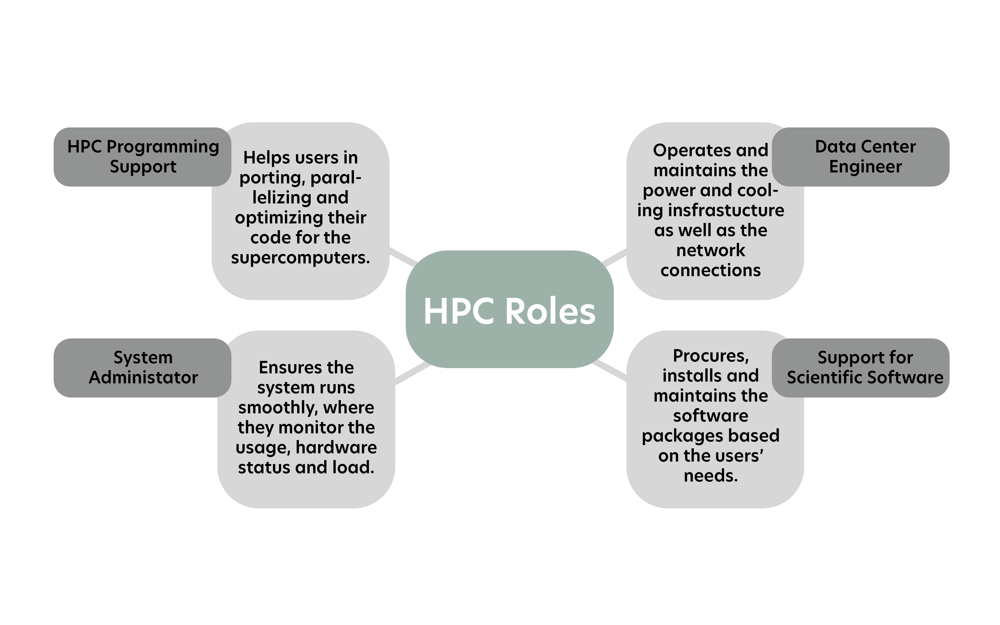
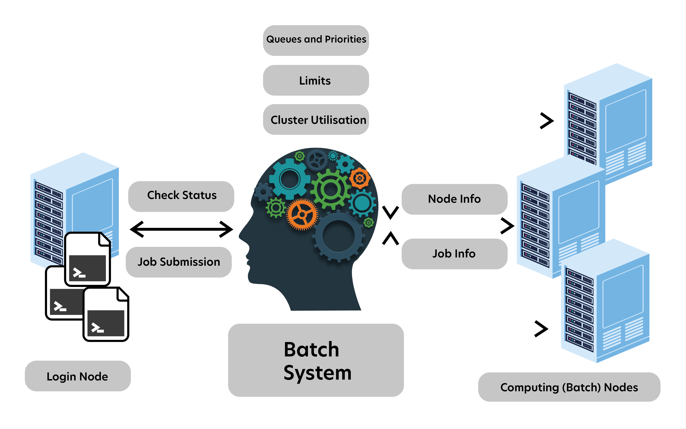

# 3. Running and using a supercomputer

## 3.1 HPC centers

## 3.2 Energy and cooling

🔘 Energy consumption is one of the biggest challenges when designing and building more powerful supercomputers

🔘**Two most common approaches of cooling**

- **air** cooling, where a steady airflow is run through the supercomputer
- **liquid** cooling, where water or other suitable liquid is circulated through the system carrying the heat away.

## 3.3 How to buy a supercomputer?

- each one customized and unique.
- computing centers typically buy technology that will **only be available later**, sometimes even after a few years.(predict the performance of a system that does not yet exist)
- **request for proposals (RFP)** is prepared with all relevant details and requirements.

## 3.4 How to access a supercomputer?

🔘 Access ways:

- via command line.
- web browser-based access(for example puhti.css.fi)

🔘 batch system then takes care of scheduling the distribution of the resources fairly; not monopolize the system

🔘 CSC provides free access to researchers and sometimes also for students with an affiliation to Finnish higher education institutions.

## 3.5 Operating systems in supercomputers

- supercomputers -> **Linux**