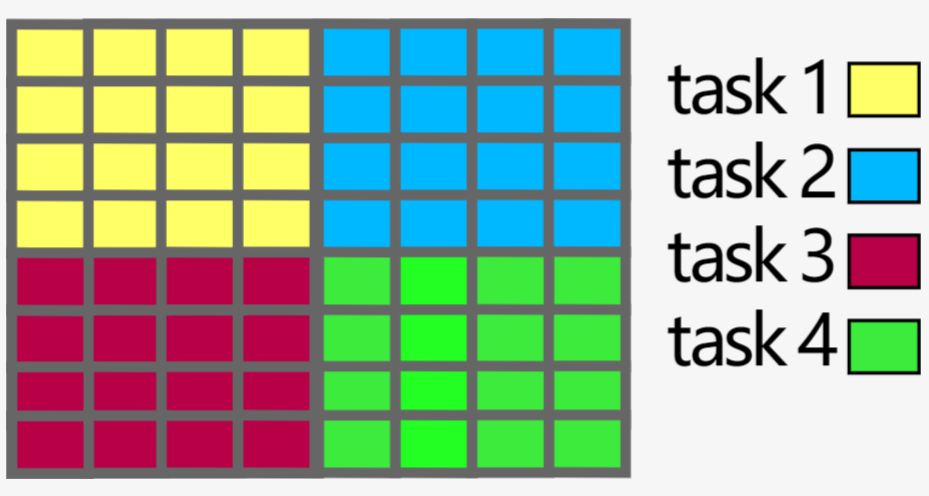
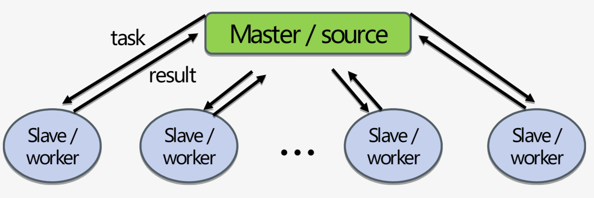

# 4. Parallel computing concepts

## 4.1 Computing in parallel

- split a computational problem into **smaller subproblems**.
- main problem solved: power consumption

## 4.2 Types of parallel algorithms

- trivially parallel algorithm: very little (or no) interaction between subtasks.
- tightly coupled algorithm: interact regularly, low-latency, high-speed interconnect between the CPUs is essential for good performance. 

### Exposing Parallelism

🔘 **Distributing the data**

- Each processing unit (e.g., CPU core) holds a part of the data typically performing **identical** or very similar operations.
- cores may need to communicate.

🔘 **Task farm (or main/worker) approach**

- One processing unit sends tasks to workers and then receives results back from them. 
- Tasks can be totally different.

🔘 Task farm and data-parallel approaches can also be combined.

## 4.3 Concepts

### Parallel Scaling

🔘 **Two types of parallel**

- **Strong parallel scaling**: input data size is kept **constant**; the number of processing units is **increased**.
- **Weak parallel scaling**: both the amount of data and number of processing units are increased simultaneously.(feasible with real-world problems)

🔘 **Purpose of parallel programming**: decrease problem-solving time.

🔘 **Parallel speed-up**: $S = \frac{T_s}{T_p}$; ${T_s}$ is execution time in serial; ${T_p}$ is execution time when use $p$ processor units.

Increasing the number of processing units beyond a certain **tipping point** might conversely extend the execution time.

### Limits of Parallel Scaling

!!! error "Several factors can limit parallel scaling."
    - parallel overheads
    - extra operations
    - communication and synchronization costs
    - load imbalance
    - serial parts in the problem

🔘 **maximum possible speed-up(Amdahl's law)**: $S_{max} = \frac{1}{1-p_f}$; ${p_f} is the fraction of the problem that can be parallelized.

### 