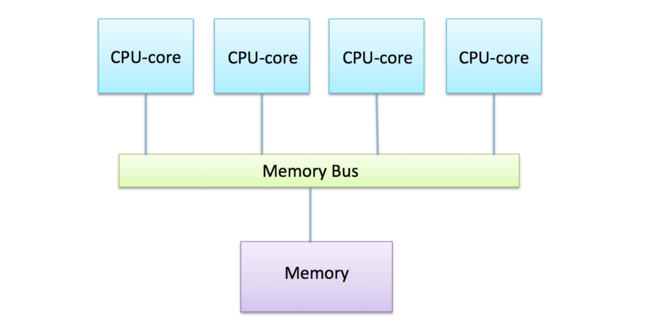
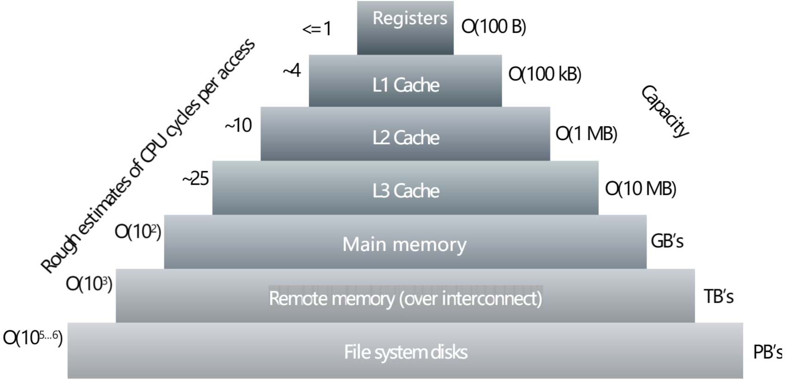
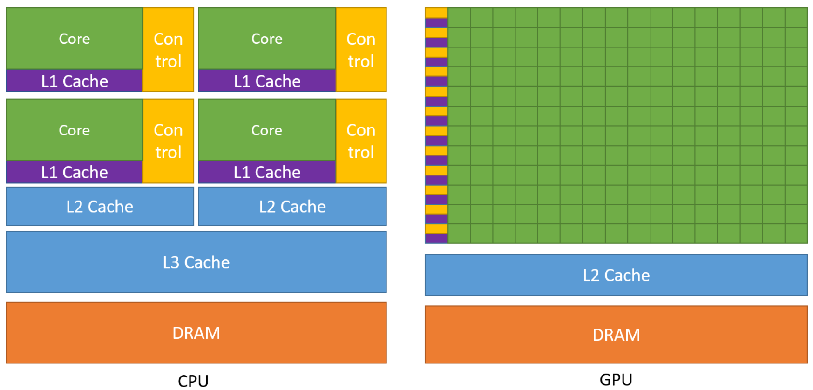
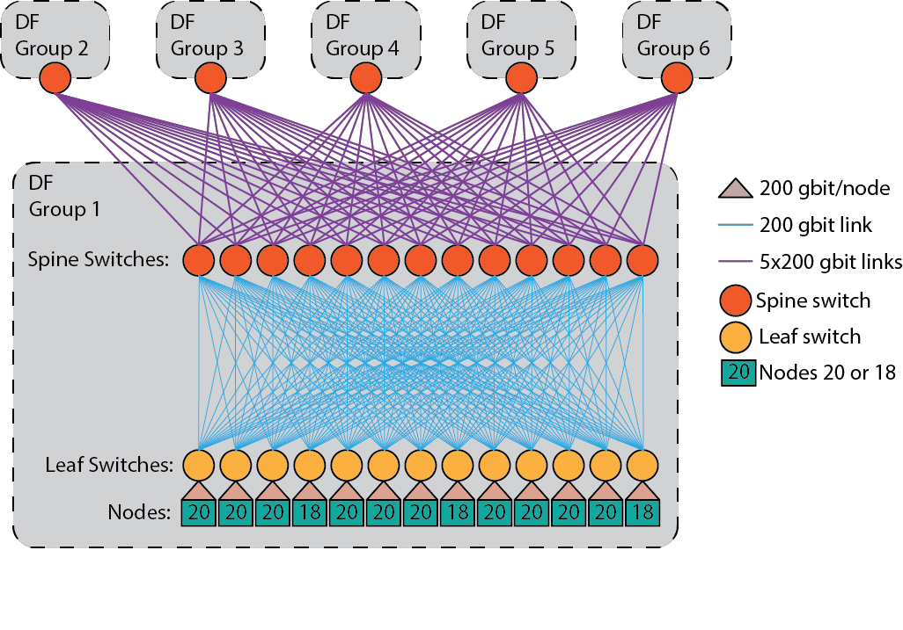

# 5.  More technical aspects of parallel computing

## 5.1 Shared memory computer

- The fundamental feature of a shared-memory computer: all the CPU cores are connected to the **same piece of memory**.
- **Memory bus**: takes requests for data from multiple sources, fetches the data from a single piece of memory

🔘 **Key challenges**

- Memory capacity
- Memory access speed: more worker -> more time idle becauze in queue
- Race conditions: erase to which part?

🔘 **Limitations**:

- **connection** between the bus and the memory
- **memory access speed**

🔘 **Advantages**:

- relatively simple program
- trade-off: memory bus <-> communication between cores. (Former is usually better).

## 5.2 Distributed memory computer

Today's approach: take lots of **separate computers** and connect them together with a **fast network**.

!!! note "Advantages"
    - "Infinite" capacity
    - "Infinite" computing power
    - No "overcrowding" of the memory bus
    - Low cost

!!! note "Limitations"
    - Possibly expensive communication
    - Communication overheads
    - Possibly saturated communication network
    - Data requirements: can be split across all the nodes
    - System and software requirements

need to write a program that utilize thousands of CPU cores, and to build software in the distributed-memory model!

## 5.3 Memory hierarchy

- a hierarchy of different levels of memory: levels of caches

### Memory Cache

- A memory cache: a small amount of very **fast** scratchpad memory close to the CPU core.

### Writing Data

!!! error "Problem in caches when writing data"
    All caches need to be notified -> an overhead grows with the number of CPU cores -> **more cpu cores, slower!!**

🔘 **cache coherency**: Keeping the data consistent and up to date on all the CPU cores. 

### Types of Memory

- Registers
- L1, L2, L3 caches
- Main memory
- Remote memory
- Disks

🔘 The pyramid order is:

- performance(fast -> slow MB/s)
- physical location(to cpu)
- access time(fast -> slow)
- capacity(small -> large)
- cost per byte(expensive -> cheap)

## 5.4 Parallelization within CPU core

Modern CPU cores can perform additional parallel operations **within** the core.

🔘 **Two different type of within cpu Parallelization**:

- **Instruction-level parallelism (ILP)**: the ability of the CPU core to simultaneously execute **multiple instructions** within one clock cycle. (e.g: two `add` in same time)
- **Vectorization**： the ability of the CPU core to perform operations on **multiple data** simultaneously.(e.g. longer register to store shorter data, `__mm128i` for two 64 bits).

## 5.5 Graphics processing units

- **CPU**: more complex! general purpose, fast and versatile, designed to run operating systems and various, very different types of applications.
- **GPU**: less powerful, high amount of parallelism.
- GPUs need CPUs on their side.

LUMI supercomputer uses AMD GPUs.

## 5.6 interconnect

🔘 **Two main characteristics of an interconnect**

- latency: minimum time it takes to do anything
- bandwidth: the rate at which large amounts of data are transferred

🔘 **The network topology**: how the connections between the nodes are arranged.

- simplest topology is a **fully connected** network(too complex and costly)
- a CPU core in a node might only need to communicate with **a few fixed cores** in another node.
- dynamically changing target

🔘 **Mahti network topology**

**Dragonfly topology**: nodes are divided into **six dragonfly groups** with **234** nodes in each

## 5.7 Maximum practical performance

Worst part: interconnect

In best scenarios, such as in the case of the LINPACK benchmark, it is possible to reach up to **80%** of the theoretical peak performance of a supercomputer.
