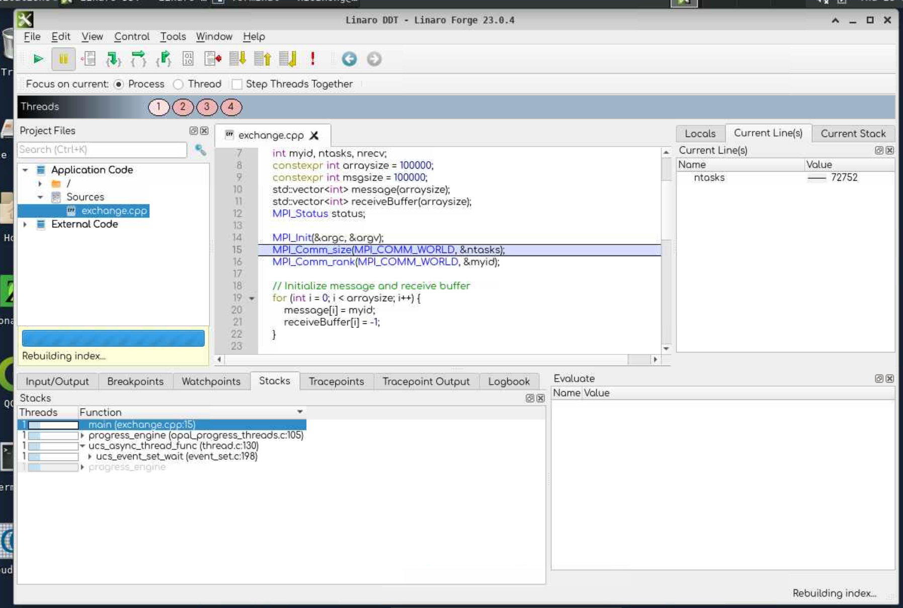

# 5. Debugging

Use the command to create environment.

```sh
module load ddt
export SLURM_OVERLAP=1
salloc -A project_2007995 --nodes=1 --ntasks-per-node=2 --time=00:15:00 --partition=test
ddt srun ./buggy
```
<div class="autocb" style="text-align:center;"></div>

For the two tasks:

- collective needs `--ntasks-per-node=4`
- exchange needs `int stag = 2; int rtag = 1;`