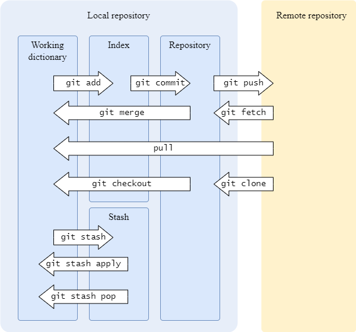

# Git

## Git commit standard cheat sheet

```tex
<type>(<scope>): <subject>
```

🔘 **Type**:

```markdown
feat：new feature
fix/to: fix bugs
docs：documentation 
style：change style, not affect code function
refactor：refactor code, not a new feature or a code change to fix a bug
perf：optimization such as improving performance and experience.
test: add testing
chore：Changes to the build process or auxiliary tools
revert: Roll back to the previous version
merge：Code merge
sync：Sync bugs on master or branches
```

🔘 **scope(optical)**:  commit range

🔘 **subject**: the objective of this commit. 


## Git explain

